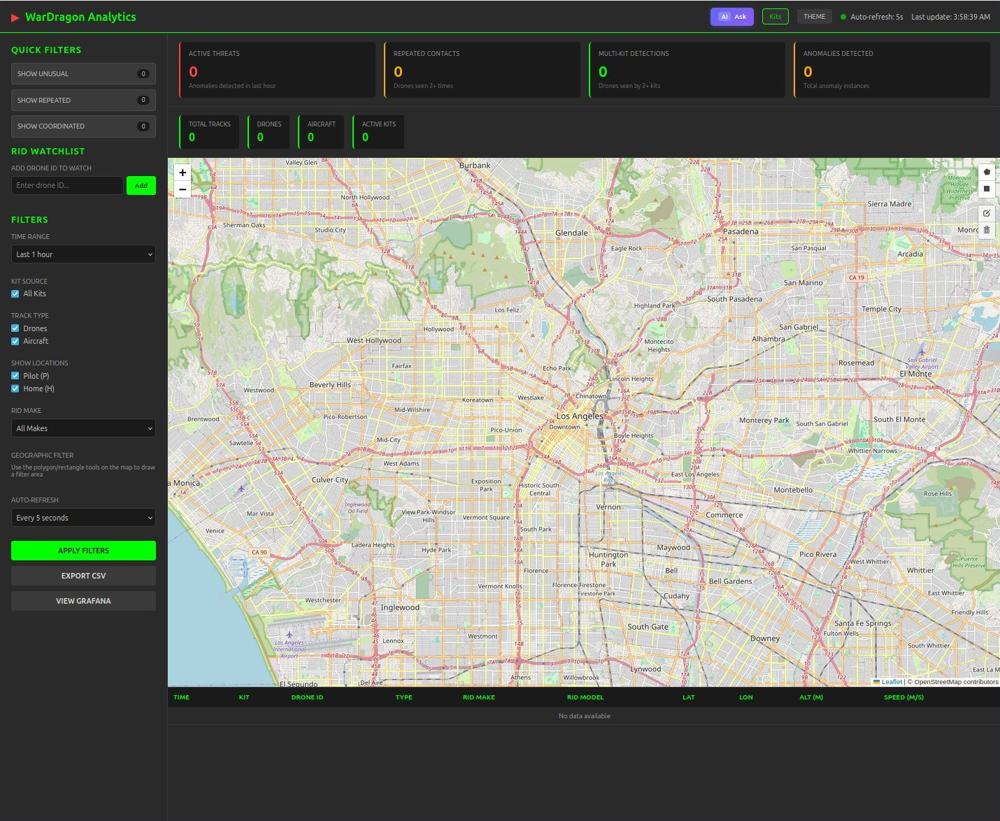

# WarDragon Analytics

Centralized logging, analysis, and visualization platform for drone detection data from one or more WarDragon kits running [DragonSync](https://github.com/alphafox02/DragonSync).

**Important:** This is designed to run on a separate server or workstation, not on the WarDragon kit itself. While it can technically run on a kit, the resource overhead (TimescaleDB, Grafana) is better suited for a dedicated machine. For lightweight on-kit history, a future integration with the WarDragon ATAK Plugin is planned to provide historical track data directly to TAK users without requiring a full analytics stack.

## Overview

WarDragon Analytics aggregates DroneID/Remote ID drone detections, ADS-B aircraft tracks, and FPV signal detections from multiple WarDragon field kits into a single interface. It provides:

- **Real-time map display** of all drone and aircraft tracks across all kits
- **Time-series database** (TimescaleDB) with 30-day retention and 1-year aggregates
- **Pattern detection** to identify surveillance behavior, coordinated swarms, and anomalies
- **Pre-built Grafana dashboards** for tactical operations and analysis
- **REST API** for integration with other systems
- **CSV export** for reporting (KML planned)
- **AI Assistant** for natural language queries (optional, requires Ollama)



## Architecture

```
WarDragon Kits (Field)     Analytics Server (Docker)      User Interfaces
+-----------------+        +----------------------+       +---------------+
| DragonSync API  |  --->  | Collector Service    |  ---> | Web UI :8090  |
| :8088           |        | TimescaleDB          |       | Grafana :3000 |
+-----------------+        +----------------------+       +---------------+
```

**Data collected from each kit:**
- Drones via DJI DroneID (OcuSync) and Remote ID (Bluetooth, Wi-Fi Beacon/NAN)
- Aircraft via ADS-B (untested)
- FPV signals (5.8GHz analog video) (untested)
- Kit system health (CPU, memory, disk, temperature, GPS position)

## Quick Start

**Prerequisites:** Docker and Docker Compose (see [docs/quickstart.md](docs/quickstart.md#installing-docker-on-ubuntu) for Ubuntu installation instructions)

```bash
# Clone the repository
git clone https://github.com/alphafox02/WarDragonAnalytics.git
cd WarDragonAnalytics

# Run the quickstart script
./quickstart.sh
```

The quickstart script will:
1. Generate secure passwords and create `.env`
2. Build and start all Docker containers
3. Initialize the database schema
4. Configure Grafana with pre-built dashboards

**Access the interfaces:**
- Web UI: http://localhost:8090
- Grafana: http://localhost:3000 (username: admin, password: shown in quickstart output)

**Configure your kits:**

There are two ways to add WarDragon kits:

**Option A: Via Web UI (Recommended)**
1. Open http://localhost:8090
2. Click "Kit Manager" in the sidebar
3. Enter the kit's API URL (e.g., `http://192.168.1.100:8088`)
4. Click "Add Kit" - the collector will start polling immediately

**Option B: Via Configuration File**
1. Edit `config/kits.yaml`:
```yaml
kits:
  - api_url: "http://192.168.1.100:8088"
    name: "Field Kit Alpha"
    enabled: true
```
2. Restart the collector:
```bash
docker compose restart collector
```

Kits added via the Web UI are stored in the database and persist across restarts. Kits in `kits.yaml` are loaded on collector startup. Both methods can be used together.

## Deployment Options

**Centralized Server (Recommended)**
- Deploy Analytics on a separate server, workstation, or cloud instance
- All field kits report to the central server
- Single pane of glass for all operations
- Best for multi-kit deployments and operations centers

**Per-Kit Local (Testing Only)**
- Can run on the same machine as DragonSync for testing
- Use `http://172.17.0.1:8088` (Linux) or `http://host.docker.internal:8088` (Mac/Windows)
- Not recommended for production due to resource overhead on the kit

**Hybrid**
- Central server aggregates from multiple kits
- Individual operators access via Grafana/Web UI
- Field units use TAK with DragonSync for real-time situational awareness

## Features

### Web UI (Port 8090)

- Interactive Leaflet map with drone tracks
- Drone, pilot, and home location markers (when provided by DroneID/Remote ID)
- Track history trails
- Real-time updates (5-second refresh)
- Kit management interface
- CSV export (untested)

### Grafana Dashboards (Port 3000)

**Tactical Overview**
- Active drone count and kit status grid
- Kit health (CPU, memory, disk, temperature)
- Drone detection timeline
- Top manufacturers detected
- Alert summary

**Pattern Analysis**
- Repeated drone detections (surveillance indicators)
- Operator reuse across multiple drones
- Coordinated activity (potential swarms)
- Frequency reuse patterns

**Multi-Kit Correlation**
- Drones detected by multiple kits (triangulation opportunities)
- Kit coverage data
- Detection density heatmap
- Kit handoff tracking

**Anomaly Detection**
- Altitude anomalies (rapid climbs/descents)
- Speed anomalies
- Signal strength variations
- Out-of-pattern behavior

### Pattern Detection API

```bash
# Drones seen multiple times (surveillance pattern)
curl http://localhost:8090/api/patterns/repeated-drones?hours=24

# Coordinated activity (swarms)
curl http://localhost:8090/api/patterns/coordinated?hours=6

# Operator reuse across drones
curl http://localhost:8090/api/patterns/pilot-reuse?hours=12

# Anomalous behavior
curl http://localhost:8090/api/patterns/anomalies?hours=6

# Multi-kit detections (triangulation)
curl http://localhost:8090/api/patterns/multi-kit?hours=6
```

## Requirements

**Server/Host:**
- Docker and Docker Compose
- 2GB RAM minimum (4GB recommended for multi-kit)
- 50GB disk (for 30 days of data from 5 kits)

**WarDragon Kits:**
- DragonSync with HTTP API enabled (default port 8088)
- Network connectivity to Analytics host

## Documentation

All documentation is located in the [docs/](docs/) folder.

### Getting Started
| Document | Description |
|----------|-------------|
| [Quick Start Guide](docs/quickstart.md) | Get up and running in 5 minutes |
| [Deployment Guide](docs/deployment.md) | Detailed deployment for production |
| [Architecture](docs/architecture.md) | System design and database schema |

### User Guides
| Document | Description |
|----------|-------------|
| [Operator Guide](docs/operator-guide.md) | Tactical operations workflows |
| [Grafana Dashboards](docs/grafana-dashboards.md) | Dashboard usage and customization |
| [AI Assistant Setup](docs/ollama-setup.md) | Natural language query interface |

### Reference
| Document | Description |
|----------|-------------|
| [API Reference](docs/api-reference.md) | REST API documentation |
| [Dashboard Queries](docs/dashboard-queries.md) | Grafana query reference |
| [Collector Service](docs/collector-service.md) | Data collection internals |
| [Test Data Generator](docs/test-data.md) | Generate realistic test data |

### Operations
| Document | Description |
|----------|-------------|
| [Troubleshooting](docs/troubleshooting.md) | Common issues and solutions |
| [Testing Guide](docs/testing.md) | Running and writing tests |
| [Security](SECURITY.md) | Security hardening and best practices |

## Common Issues & Quick Fixes

**Database schema missing / views not created:**

This happens if you ran `docker compose up` directly without using `quickstart.sh`, or if the database initialization failed. The init scripts only run on first startup when the database volume is empty.

```bash
# Option 1: Full reset (WARNING: -v flag DELETES ALL DATA)
docker compose down -v
./quickstart.sh

# Option 2: Apply schema to existing database (preserves data)
docker exec -i wardragon-timescaledb psql -U wardragon -d wardragon < timescaledb/01-init.sql
docker exec -i wardragon-timescaledb psql -U wardragon -d wardragon < timescaledb/02-pattern-views.sql
docker exec -i wardragon-timescaledb psql -U wardragon -d wardragon < timescaledb/03-extended-fields.sql
```

> **Note:** Running `./quickstart.sh` alone is safe and won't delete data. The `-v` flag on `docker compose down` is what removes database volumes.

**Web UI inaccessible after running quickstart.sh on existing containers:**

If you run `./quickstart.sh` while containers are already running, the web UI (port 8090) may become inaccessible due to containers entering an inconsistent state.

```bash
# Stop containers first, then run quickstart
docker compose down
./quickstart.sh

# If that doesn't work, full reset (WARNING: deletes data)
docker compose down -v
./quickstart.sh
```

**Containers won't start / port conflicts:**

```bash
# Check what's using the ports
sudo lsof -i :8090 -i :3000

# Full cleanup and restart
docker compose down -v
docker system prune -f
./quickstart.sh
```

For detailed troubleshooting, see [docs/troubleshooting.md](docs/troubleshooting.md).

## Useful Commands

```bash
# Start services
docker compose up -d

# Stop services
docker compose down

# View logs
docker compose logs -f collector
docker compose logs -f web

# Restart after config change
docker compose restart collector

# Check service health
./healthcheck.sh

# Database backup
docker exec wardragon-timescaledb pg_dump -U wardragon wardragon > backup.sql
```

## Test Data

Generate realistic test data to explore the dashboards:

```bash
python tests/generate_test_data.py --scenario all
```

Available scenarios: `normal`, `repeated`, `coordinated`, `operator`, `multikit`, `anomalies`, `fpv`

## Related Projects

- [DragonSync](https://github.com/alphafox02/DragonSync) - Drone detection and TAK integration for WarDragon kits
- [DragonOS](https://cemaxecuter.com/) - Linux distribution for SDR and drone detection

## License

Apache 2.0

## Contributing

1. Read [docs/architecture.md](docs/architecture.md)
2. Open an issue to discuss your idea
3. Fork, implement, test, submit PR

## Support

- Issues: [GitHub Issues](https://github.com/alphafox02/WarDragonAnalytics/issues)
- DragonSync: [alphafox02/DragonSync](https://github.com/alphafox02/DragonSync)
